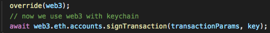
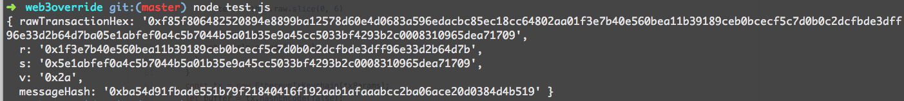

* `keychain.js` - Keychain class with ws connection initialization
* `index.js` - override `web3.eth.accounts.signTransaction` method 
* `test.js` - example usage together (`keychain` + `web3`) 

**Usage**

**Result**

